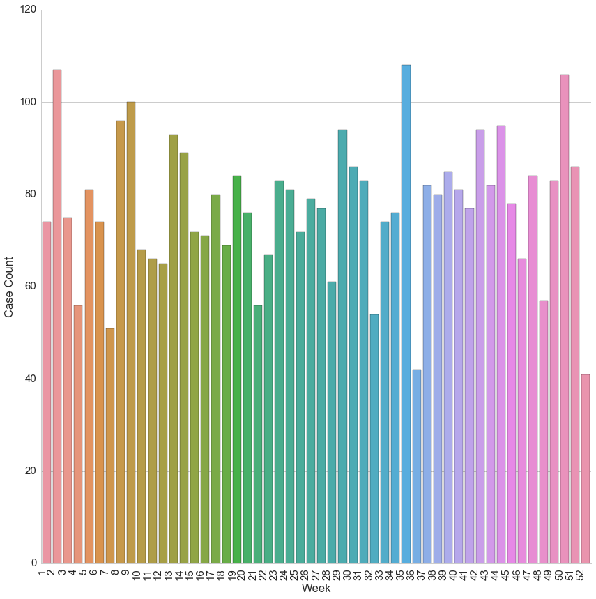

# 2014 Scraped Foreclosure Case Data


```python
from pandas import DataFrame, read_csv, to_datetime

import seaborn as sns
import matplotlib.pyplot as plt
sns.set(style="whitegrid", font_scale=1.5)
%matplotlib inline
```


```python
df = read_csv("2014_clean.csv")
```


```python
df["Filing Date"] = to_datetime(df["Filing Date"])

df.head()
```


<div>
<table border="1" class="dataframe">
  <thead>
    <tr style="text-align: right;">
      <th></th>
      <th>Filing Date</th>
      <th>Case Number</th>
      <th>Case Type</th>
      <th>Title</th>
      <th>Plaintiff</th>
      <th>Defendant</th>
      <th>Address</th>
      <th>Zip Code</th>
      <th>Partial Cost</th>
    </tr>
  </thead>
  <tbody>
    <tr>
      <th>0</th>
      <td>2013-03-18</td>
      <td>24O14000813</td>
      <td>Mortgage</td>
      <td>Lloyd D Lurie vs SADA LLC</td>
      <td>Lloyd D Lurie</td>
      <td>SADA LLC</td>
      <td>4300 Erdman Ave</td>
      <td>21213.0</td>
      <td>$194,892.43</td>
    </tr>
    <tr>
      <th>1</th>
      <td>2013-07-24</td>
      <td>24O14002232</td>
      <td>Mortgage</td>
      <td>John E Driscoll III vs Estate Of Earl Jerry Sye</td>
      <td>John E Driscoll III</td>
      <td>Estate Of Earl Jerry Sye</td>
      <td>4033 Boarman Ave</td>
      <td>21215.0</td>
      <td>NaN</td>
    </tr>
    <tr>
      <th>2</th>
      <td>2014-01-02</td>
      <td>24O14000001</td>
      <td>Mortgage</td>
      <td>James E Clarke vs Tiffany R Harris</td>
      <td>James E Clarke</td>
      <td>Tiffany R Harris</td>
      <td>4603 Valley View Ave</td>
      <td>21206.0</td>
      <td>$175,648.50</td>
    </tr>
    <tr>
      <th>3</th>
      <td>2014-01-02</td>
      <td>24O14000002</td>
      <td>Mortgage</td>
      <td>James W Holderness vs Intercoastal Investment ...</td>
      <td>James W Holderness</td>
      <td>Intercoastal Investment Trust Ltd</td>
      <td>4718 Edmondson Ave</td>
      <td>21229.0</td>
      <td>$166,358.48</td>
    </tr>
    <tr>
      <th>4</th>
      <td>2014-01-02</td>
      <td>24O14000003</td>
      <td>Mortgage</td>
      <td>James W Holderness vs Intercoastal Investment ...</td>
      <td>James W Holderness</td>
      <td>Intercoastal Investment Trust Ltd</td>
      <td>333 N Stricker St</td>
      <td>21223.0</td>
      <td>$23,189.54</td>
    </tr>
  </tbody>
</table>
</div>


```python
print "Count of features:\n"
print df.count()
```

    Count of features:
    
    Filing Date     4017
    Case Number     4017
    Case Type       4017
    Title           4017
    Plaintiff       4015
    Defendant       4015
    Address         4017
    Zip Code        3513
    Partial Cost    3539
    dtype: int64


```python
print "NULL count:\n"
print df.isnull().sum()
```

    NULL count:
    
    Filing Date       0
    Case Number       0
    Case Type         0
    Title             0
    Plaintiff         2
    Defendant         2
    Address           0
    Zip Code        504
    Partial Cost    478
    dtype: int64


```python
new_df = DataFrame(df.groupby(df["Filing Date"].dt.week)['Case Number'].count())
new_df.columns = ["Case Count"]
new_df["Week"] = new_df.index
```


```python
print "Distribution of cases:\n"
print new_df["Case Count"].describe()
```

    Distribution of cases:
    
    count     52.000000
    mean      77.250000
    std       14.988721
    min       41.000000
    25%       68.750000
    50%       78.500000
    75%       84.250000
    max      108.000000
    Name: Case Count, dtype: float64


```python
p = sns.factorplot(x="Week", y='Case Count', kind='bar', data=new_df, size=12)
p.set_xticklabels(rotation=90, horizontalalignment='right')
```


    <seaborn.axisgrid.FacetGrid at 0x7f7b31be8b90>





```python

```
