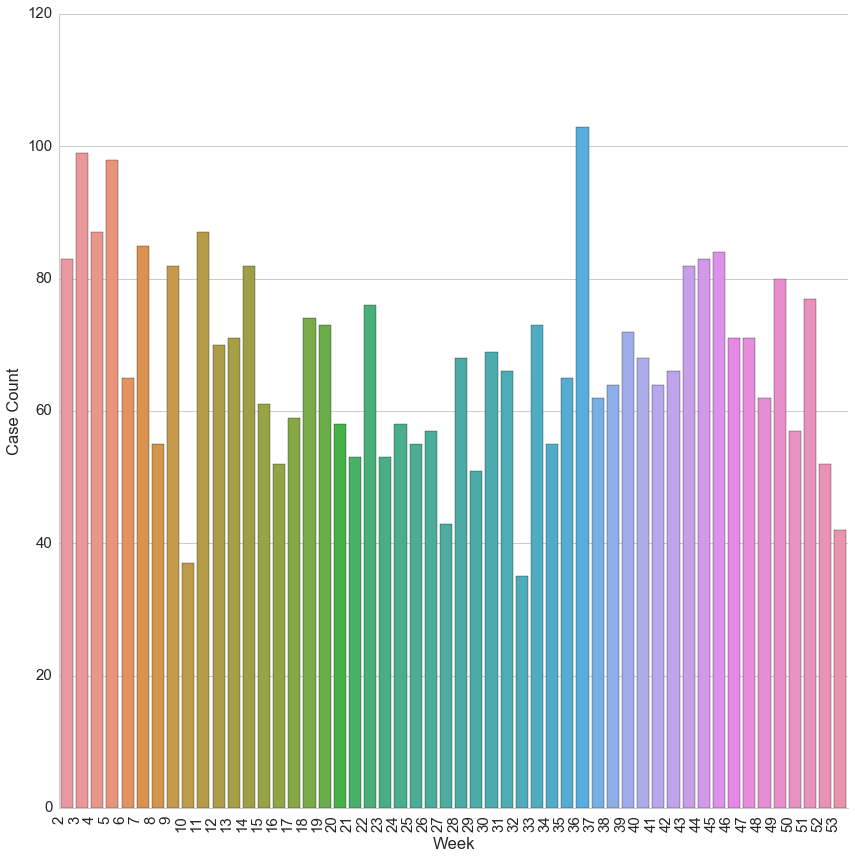

# 2015 Scraped Foreclosure Case Data


```python
from pandas import DataFrame, read_csv, to_datetime

import seaborn as sns
import matplotlib.pyplot as plt
sns.set(style="whitegrid", font_scale=1.5)
%matplotlib inline
```


```python
df = read_csv("2015.csv")
```


```python
df["Zip Code"] = df["Zip Code"].fillna(0.0).astype(int)
df["Zip Code"] = df["Zip Code"].replace(0, '')

df["Filing Date"] = to_datetime(df["Filing Date"])

df.head()
```


<div>
<table border="1" class="dataframe">
  <thead>
    <tr style="text-align: right;">
      <th></th>
      <th>Filing Date</th>
      <th>Case Number</th>
      <th>Case Type</th>
      <th>Title</th>
      <th>Plaintiff</th>
      <th>Defendant</th>
      <th>Address</th>
      <th>Zip Code</th>
      <th>Partial Cost</th>
    </tr>
  </thead>
  <tbody>
    <tr>
      <th>0</th>
      <td>2015-01-05</td>
      <td>24O15000001</td>
      <td>Mortgage</td>
      <td>Edward S Cohn vs Estate Of Sharon Stenhouse</td>
      <td>Edward S Cohn</td>
      <td>Estate Of Sharon Stenhouse</td>
      <td>3456 Dolfield Ave</td>
      <td>21215</td>
      <td>$57,793.24</td>
    </tr>
    <tr>
      <th>1</th>
      <td>2015-01-05</td>
      <td>24O15000002</td>
      <td>Mortgage</td>
      <td>James E Clarke vs Christopher Frankos</td>
      <td>James E Clarke</td>
      <td>Christopher Frankos</td>
      <td>3015 Grindon Ave</td>
      <td>21214</td>
      <td>$279,975.59</td>
    </tr>
    <tr>
      <th>2</th>
      <td>2015-01-05</td>
      <td>24O15000003</td>
      <td>Mortgage</td>
      <td>C.Larry Hofmeister Jr vs FTIC LLC, et al</td>
      <td>C.Larry Hofmeister Jr</td>
      <td>FTIC LLC, et al</td>
      <td>2819 Pelham Ave</td>
      <td>21213</td>
      <td>NaN</td>
    </tr>
    <tr>
      <th>3</th>
      <td>2015-01-05</td>
      <td>24O15000003</td>
      <td>Mortgage</td>
      <td>C.Larry Hofmeister Jr vs FTIC LLC, et al</td>
      <td>C.Larry Hofmeister Jr</td>
      <td>FTIC LLC, et al</td>
      <td>3608 Beehler Ave</td>
      <td>21215</td>
      <td>NaN</td>
    </tr>
    <tr>
      <th>4</th>
      <td>2015-01-05</td>
      <td>24O15000003</td>
      <td>Mortgage</td>
      <td>C.Larry Hofmeister Jr vs FTIC LLC, et al</td>
      <td>C.Larry Hofmeister Jr</td>
      <td>FTIC LLC, et al</td>
      <td>3631 W Belvedere Ave</td>
      <td>21215</td>
      <td>NaN</td>
    </tr>
  </tbody>
</table>
</div>


```python
print "NULL count:\n"
print df.isnull().sum()
```

    NULL count:
    
    Filing Date       0
    Case Number       0
    Case Type         0
    Title             0
    Plaintiff        11
    Defendant        11
    Address           0
    Zip Code          0
    Partial Cost    207
    dtype: int64


```python
new_df = DataFrame(df.groupby(df["Filing Date"].dt.week)['Case Number'].count())
new_df.columns = ["Case Count"]
new_df["Week"] = new_df.index
```


```python
new_df.describe()
```


<div>
<table border="1" class="dataframe">
  <thead>
    <tr style="text-align: right;">
      <th></th>
      <th>Case Count</th>
      <th>Week</th>
    </tr>
  </thead>
  <tbody>
    <tr>
      <th>count</th>
      <td>52.000000</td>
      <td>52.000000</td>
    </tr>
    <tr>
      <th>mean</th>
      <td>67.596154</td>
      <td>27.500000</td>
    </tr>
    <tr>
      <th>std</th>
      <td>15.092213</td>
      <td>15.154757</td>
    </tr>
    <tr>
      <th>min</th>
      <td>35.000000</td>
      <td>2.000000</td>
    </tr>
    <tr>
      <th>25%</th>
      <td>57.000000</td>
      <td>14.750000</td>
    </tr>
    <tr>
      <th>50%</th>
      <td>67.000000</td>
      <td>27.500000</td>
    </tr>
    <tr>
      <th>75%</th>
      <td>77.750000</td>
      <td>40.250000</td>
    </tr>
    <tr>
      <th>max</th>
      <td>103.000000</td>
      <td>53.000000</td>
    </tr>
  </tbody>
</table>
</div>


```python
p = sns.factorplot(x="Week", y='Case Count', kind='bar', data=new_df, size=12)
p.set_xticklabels(rotation=90, horizontalalignment='right')
```


    <seaborn.axisgrid.FacetGrid at 0x7f98a7768490>




